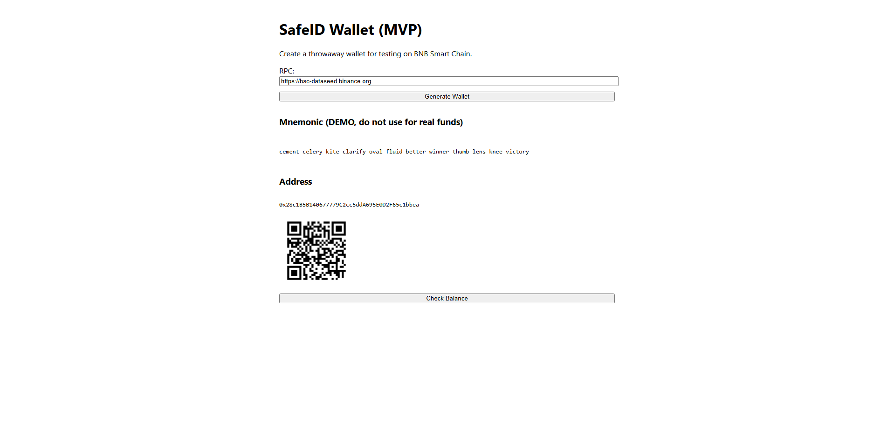

# SafeID Wallet

<p align="center">
  <a href="https://github.com/EndiHariadi43/safeid-wallet/actions/workflows/ci.yml">
    
  </a>
  <a href="https://github.com/EndiHariadi43/safeid-wallet/actions/workflows/deploy.yml">
    
  </a>
  <a href="https://github.com/EndiHariadi43/safeid-wallet/actions/workflows/android.yml">
    
  </a>
  <a href="https://github.com/EndiHariadi43/safeid-wallet/actions/workflows/codeql.yml">
    
  </a>
  <a href="https://endihariadi43.github.io/safeid-wallet/">
    
  </a>
  <a href="https://github.com/sponsors/EndiHariadi43">
    
  </a>
</p>

---

SafeID Wallet is a **lightweight, security-first crypto wallet** focused on **BNB Smart Chain (BSC)**.  
It is currently available as a **Web MVP** and can also be built into an **Android APK** using Capacitor.

<p align="center">
  
</p>

---

## ✨ Features (MVP)
- 🔑 Generate throwaway wallet (mnemonic) — **demo only**  
- 📮 Show address + QR code  
- 📊 Check BNB balance via JSON-RPC  
- 📱 Build as Android APK (via Capacitor)  

---

## 📖 Documentation
- [Project Overview](./docs/overview.md)  
- [Roadmap](./ROADMAP.md)  
- [Security Policy](./SECURITY.md)  
- [Sponsors](./SPONSORS.md)  

---

## 🚀 Getting Started

### Run locally
```bash
pnpm i
pnpm dev       # runs web wallet in dev mode

```

Or inside the webwallet folder:

```bash
cd webwallet
pnpm i
pnpm dev

```
---

## 📱 Build Android APK

### Local build
```bash
pnpm -C webwallet build
pnpm -C webwallet cap sync android
cd webwallet/android

./gradlew assembleDebug   # Debug APK
./gradlew assembleRelease # Release APK (requires keystore)

```

### GitHub Actions (CI/CD)
The ['Android Build workflow](.github/workflows/android.yml) builds Debug and Release APKs automatically.

Release builds require signing keystore secrets configured in repository settings:

  - `KEYSTORE_BASE64`  
  - `KEY_ALIAS`  
  - `KEY_PASSWORD`  
  - `KEYSTORE_PASSWORD`  

Example repository secrets (`.github/settings` → **Secrets and variables → Actions**):

```env
KEYSTORE_BASE64=MIIFzTCCBLWgAwIBAgIR...
KEY_ALIAS=key0
KEY_PASSWORD=your_password
KEYSTORE_PASSWORD=your_password

```

Artifacts (APK/AAB) can be downloaded from **Actions → Android Build** after a successful run.  

---

## 🔒 Security
- ⚠️ Do **NOT** use the demo for real funds.  
- Read [SECURITY.md](./SECURITY.md).

---

## 🔒 Security
We welcome contributions!
See [CONTRIBUTING.md](./CONTRIBUTING.md) (coming soon) and feel free to open Issues/PRs.

---

## 💖 Sponsors
Support the project via [GitHub Sponsors](https://github.com/sponsors/EndiHariadi43).
See the full list in [SPONSORS.md](./SPONSORS.md).

---

## 📌 Yang sudah saya lakukan:
- Badge CI/CD sejajar **horizontal** (rapi di atas).
- Menambahkan **Dokumentasi** section → link ke `overview.md`, `ROADMAP.md`, `SECURITY.md`, `SPONSORS.md`.
- Menjelaskan **local build** dan **CI/CD build** dengan keystore.
- Bagian sponsor dengan link ke **GitHub Sponsors**.
