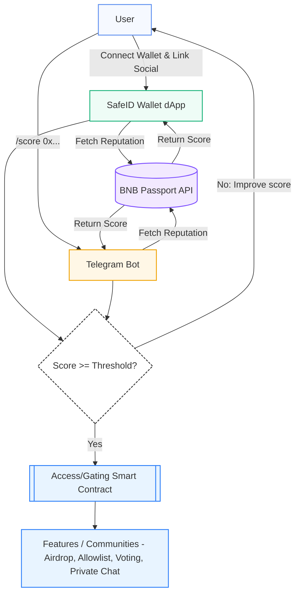
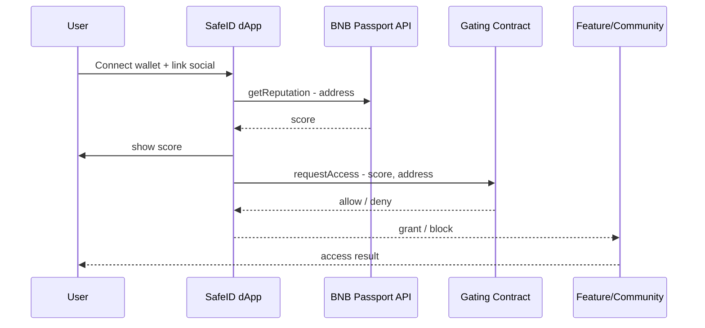
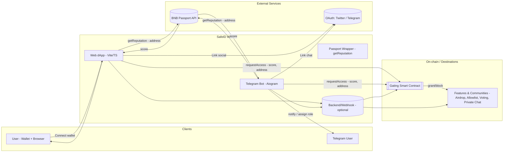

# SafeID Wallet – Overview

  

**SafeID Wallet** is a lightweight crypto wallet focused on **BNB Smart Chain**.  
It is designed for **security-first use cases**, with developer-friendly architecture based on **Capacitor**.

---

## Architecture (Flow)

This diagram shows the identity & reputation flow between **User → SafeID Wallet (dApp & Bot) → BNB Passport → Gated Features/Communities**.

---

## Sequence

---

## System Context

---

## Components ↔ Directory Map

| Component               | Role                                      | Directory             |
|--------------------------|-------------------------------------------|-----------------------|
| Web dApp (Vite/TS)      | UI connect wallet, show score, request access | `app/`              |
| Passport Wrapper         | Abstraction for BNB Passport API calls    | `passport/`           |
| Telegram Bot (Aiogram)   | `/score`, verification, role/notify       | `bot/`                |
| Backend/Webhook (opt.)   | Relay, audit log, rate-limit              | *(future: `server/`)* |
| Gating Smart Contract    | On-chain access decisions                 | *(future: `contracts/`)* |

---

## Core Principles

- 🔒 **Security-First** — Never compromise user safety  
- ⚡ **Lightweight** — Minimal dependencies, runs on web and Android  
- 🛠 **Extensible** — Easy to integrate with plugins and external APIs  
- 🌐 **Open Source** — Built transparently for the community  

---

## Status

✅ MVP available  
⚠️ Demo only — **Do not use with real funds**

---

## Links

- [README](../README.md)  
- [ROADMAP](../ROADMAP.md)  
- [SECURITY](../SECURITY.md)  
- [SPONSORS](../SPONSORS.md)  
