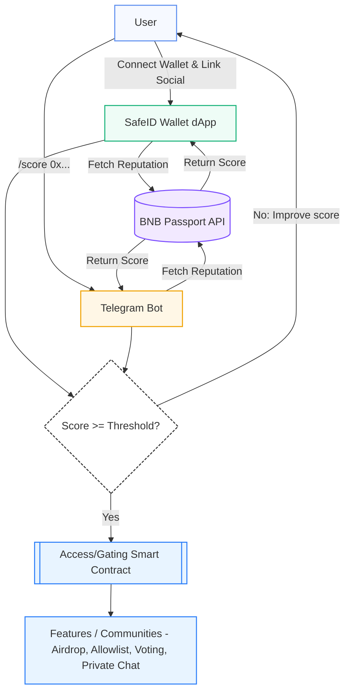
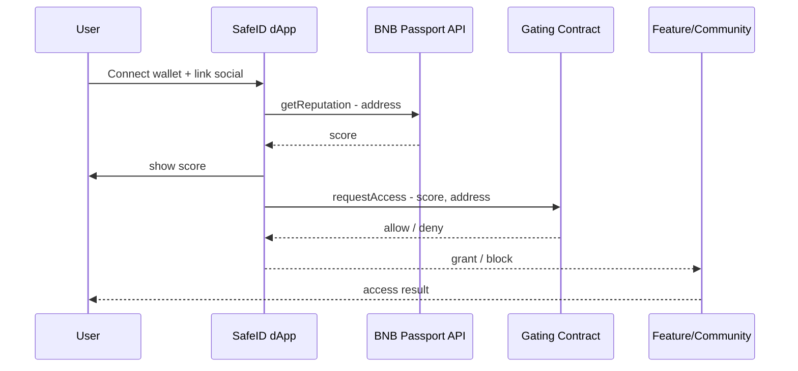
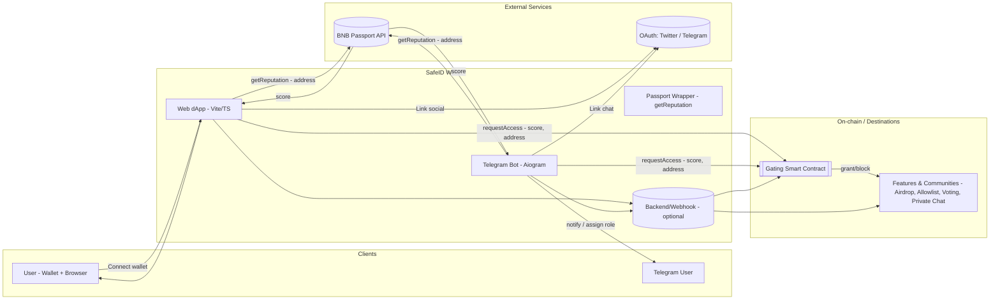

# SafeID Wallet – Overview

SafeID Wallet is a lightweight crypto wallet focused on **BNB Smart Chain**.  
It is designed for **security-first use cases**, with developer-friendly architecture based on **Capacitor**.

---

## Features (MVP)
- 🔑 Generate throwaway wallet (mnemonic) — **demo only**
- 📱 Show address + QR
- 💰 Check BNB balance via JSON-RPC
- 📦 Build as Android APK (via Capacitor)

---

## Roadmap
See [ROADMAP.md](./ROADMAP.md).

---

## Build Toolchain

- **AGP**: 8.7.2  
- **Gradle**: 8.13  
- **JDK**: 17  
- **compileSdk / targetSdk**: 36  
- **minSdk**: 23  
- **Kotlin jvmTarget**: 17  
- **Package manager**: PNPM v9

---

## Toolchain
- **Web**: Vite + TypeScript + PNPM  
- **Mobile**: Capacitor + Android Studio (Gradle)  
- **Bot**: Telegram Bot (Aiogram, Python)  
- **Optional backend**: Python/Node relay server

---

## Build & Run

### Run locally
```bash
pnpm i
pnpm dev       # runs web wallet in dev mode
```

Or run inside the `webwallet` folder:

```bash
cd webwallet
pnpm i
pnpm dev
```

### Build Android APK
```bash
pnpm -C webwallet build
pnpm -C webwallet cap sync android
cd webwallet/android
./gradlew assembleDebug   # debug APK
./gradlew assembleRelease # release APK (requires keystore)
```

Artifacts (APK) are also produced automatically by GitHub Actions:  
check the **Actions → Android Build** workflow.

---

## SafeID Wallet – Architecture

**Architecture Summary**
- **Web App**: Vue/React frontend with PNPM  
- **Capacitor Bridge**: Sync between web and Android  
- **Android Client**: Built via Gradle + Capacitor

SafeID Wallet is structured around **Capacitor** bridging:

- **Web dApp (`webwallet/`)**:  
  Vite/TypeScript frontend for wallet generation, reputation score, and feature gating.

- **Android (`webwallet/android/`)**:  
  Capacitor wrapper that embeds the web app and builds into APK/AAB via Gradle.

- **Planned Components**:  
  - `passport/`: thin wrapper for BNB Passport API  
  - `bot/`: Telegram bot (Aiogram)  
  - `server/`: optional backend/webhook  
  - `contracts/`: on-chain gating logic

This diagram shows the identity & reputation flow between **User → SafeID Wallet (dApp & Bot) → BNB Passport → Gated Features/Communities**.



---

## SafeID Wallet – Sequence



---

## SafeID Wallet – Components / System Context



---

### Component ↔ Directory Map
| Komponen | Peran | Direktori |
|---|---|---|
| Web dApp (Vite/TS) | UI connect wallet, tampilkan skor, kirim request akses | `app/` |
| Passport Wrapper | Abstraksi pemanggilan BNB Passport API | `passport/` |
| Telegram Bot (Aiogram) | Perintah `/score`, verifikasi, role/notify | `bot/` |
| Backend/Webhook (opsional) | Relay, audit log, rate-limit | *(nanti: `server/` jika dibutuhkan)* |
| Gating Smart Contract | Keputusan akses on‑chain | *(nanti: `contracts/`)* |

---

## Core Principles
- 🔒 **Security-First** — Never compromise user safety.
- ⚡ **Lightweight** — Minimal dependencies, runs on web and Android.
- 🛠 **Extensible** — Easy to integrate with plugins and external APIs.
- 🌐 **Open Source** — Built transparently for the community.

---

## Current Status
✅ MVP available  
⚠️ Demo only — **Do not use with real funds**

---

## Links
- [README](../README.md)  
- [ROADMAP](../ROADMAP.md)  
- [SECURITY](../SECURITY.md)  
- [SPONSORS](../SPONSORS.md)  
